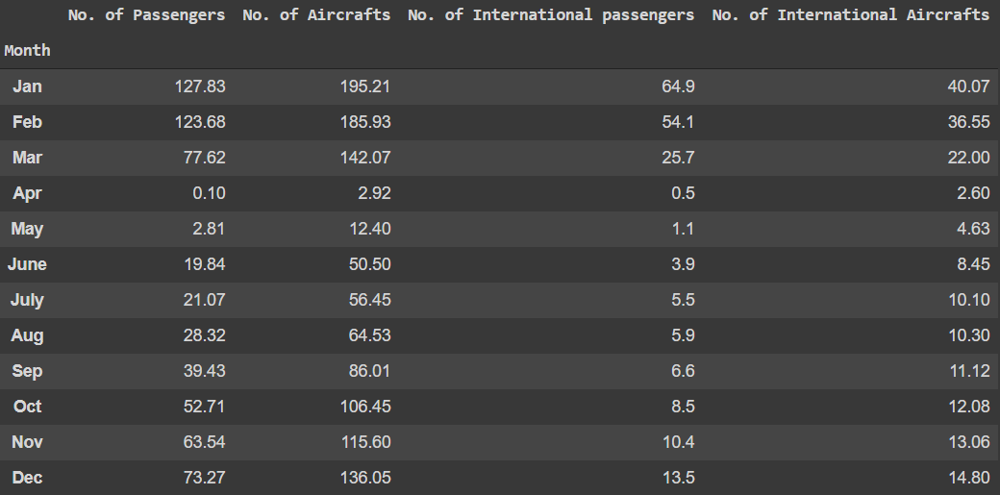

# Impact of Covid of Aviation
## Team Aerosouls

### Link to the report: 
```
https://drive.google.com/file/d/10aPPm4Y2HsuUBCgUJilpNLQrPPp9vl82/view?usp=sharing
```

### Link to the Project Description Video
```
https://drive.google.com/file/d/1vxPUB_bidqo6jVL9A9cwnLVNwfQ5ge1W/view?usp=sharing
```

In this Course Project we analysed the affect ***Covid-19 on Aviation*** using ***Hypothesis Testing*** and various other techniques. We also Verified the ***Central Value theorem***. 




<hr>
We found out the ***Joint Distribution*** for our 2 Random Variables - ***Number of Aircrafts and Number of Passengers***. 
<br>


<hr>

We performed regression where we predicted the number of aircrafts based on the number of passengers and found out the ***Confidence Intervals*** for ***Mean, Variance and the best fit for Regression***<br>


